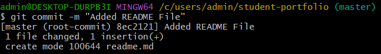
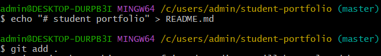
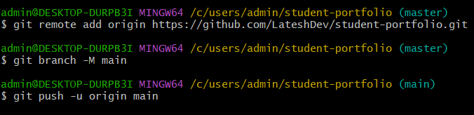

# git-github-practice

Learning Git &amp; GitHub basics: git init, add, commit, push, clone, pull.

📘 What is Git?

Git is a Version Control System (VCS) that helps developers track changes in their code. It allows you to save different versions of a project, restore previous versions, and collaborate with others.

Real-life example:

Think of Git as the Save feature in a game. Every commit is like a save point that you can return to later

🌐 What is GitHub?

GitHub is a cloud-based platform where Git repositories are stored online. It allows developers to back up projects, collaborate with others, review code, and contribute to open-source software.

Real-life example:

Git is your notebook at home, while GitHub is Google Drive where you upload and share that notebook.

🔄 Git Workflow

Create Project

      ↓
      
git init

      ↓
      
git add
.
      ↓
      
git commit -m "Message"

      ↓
      
git remote add origin URL

      ↓
      
git push origin main

💻 Flow of Git Commands

1. Git int -

   git init initializes a new Git repository in your project folder. It creates a hidden .git directory where Git stores the project's history and configuration.

   syntax - git init
   

   

   

3. Git add -

   git add moves files to the staging area. Git will include only staged files in the next commit.

   syntax - git add.
   

   
   

4. Git commit -

    Saves changes permanently in local repository
    Requires a message describing changes

    syntax - git commit -m "your message"

   

   

6. Git push -

   Uploads code to remote repository

   syntax - git push -u origin main

   

   

🎯 Conclusion

Git commands provide a systematic way to manage code versions and collaboration. By using commands like git add, git commit, and git push, developers can track changes, maintain history, and share code efficiently. Understanding both theory and syntax ensures better control over projects and makes development more organized and reliable.

